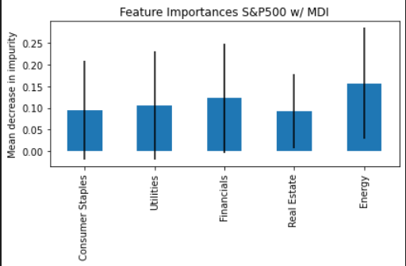
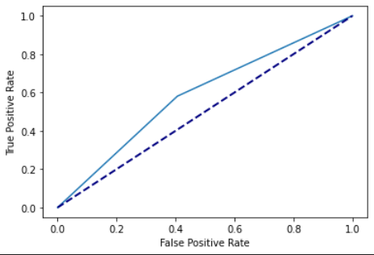
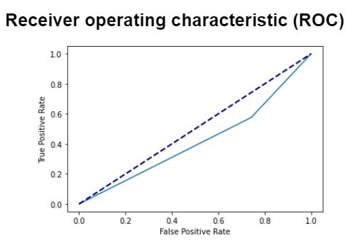
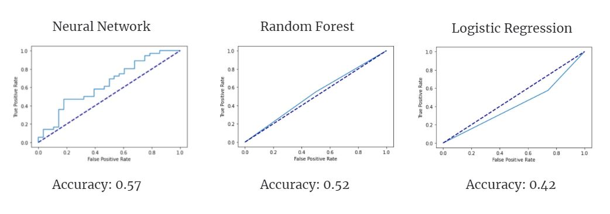

<!-- Find and Replace All [repo_name] -->
<!-- Replace [product-screenshot] [product-url] -->
<!-- Other Badgets https://naereen.github.io/badges/ -->

[![Contributors][contributors-shield]][contributors-url]
[![Forks][forks-shield]][forks-url]
[![Stargazers][stars-shield]][stars-url]
[![Issues][issues-shield]][issues-url]

# Machine learning index prediction

This repository represents comparing of performance machine learning model and neural network model. It uses yesterday’s market data from various SP500 sub-indexes.

---

## Approach

1. Data Formating

2. Creating and tuning the Neural network (Sequential)

3. Creating and tuning the Linear Regression and/or logistic

4. Comparison

---

## Technologies

This project leverages the following tools for financial analysis:

- [Conda](https://docs.conda.io/en/latest/) - source package management system and environment management system.

- [Pandas](https://pandas.pydata.org) - Python library that’s designed specifically for data analysis.

- [JupyterLab](https://jupyter.org) - For running and review Python-based programs.

- [StandardScaler](https://scikit-learn.org/stable/modules/generated/sklearn.preprocessing.StandardScaler.html) - For Standardization of datasets

- [scilit-learn](https://scikit-learn.org/stable/) - tool for predictive data alalysis

- [TensorFlow](https://www.tensorflow.org) - open-source machine learning platform

- [Keras](https://keras.io) - is an open-source software library that provides a Python interface for artificial neural networks.

---

## Input data

Input data is yesterday’s market data from various SP500 sub-indexes. Sub-indexes to use: Sectors.
`SP500.db` contains data for analysis.

Data is provided preformatted via the SP500.db. Tables included are:

- SectorDF: Base Data, includes all the SP500 stocks broken into sectors and averaged. Timeframe is 1Y.
- SectorDF3Y: 3 Year version of the Data.
- SectorDFNegative and SectorDF3YNegative: 1Y and 3Y versions of the data, but SPY is -1 when its negative instead of 0.
- SectorDFLarge and SectorDF3YLarge: 1Y and 3Y versions of the data, but spy is 1 if its greater than 0.005, -1 if less than -0.005, or 0 if in between.

Data can be pulled from teh Alpaca API using SP500.ipynb and stored in the DB. An alpaca API key is required and should be stored in a .env file (not included). However sample data is preloaded in the Database running the SPI is not necessary.

---

## Neural network

To create a neural network, a Sequential model was chosen. It is one of the most popular models in the Keras.

```
nn = Sequential() # creating model sequence
```

Example of the input data:


All data was separated for inputs and outputs:

1. Inputs are categories columns:

```
Industrials
Health Care
Information Technology
Communication Services
Consumer Staples
Consumer
Discretionary
Utilities
Financials
Materials
Real Estate
Energy
```

2. Outputs are SPY column transformed to discrete outputs/ like 0 and 1.

The test data (y_train) doesn't require to resampling. Proportions of the 0 and 1 are pretty similar.

```
0.0    96
1.0    94
Name: SPY, dtype: int64
```

During testing, a more efficient configuration was revealed:

```
Model: "sequential"
_________________________________________________________________
 Layer (type)                Output Shape              Param #
=================================================================
 dense (Dense)               (None, 16)                192

 dense_1 (Dense)             (None, 16)                272

 dense_2 (Dense)             (None, 1)                 17

=================================================================
Total params: 481
Trainable params: 481
Non-trainable params: 0
```

After the trainig with 350 epochs. Great result!

```
Loss: 0.22692200541496277, Accuracy: 0.9263157844543457
```


But with the test data results. Not bad.

```
Loss: 0.9621024131774902, Accuracy: 0.578125
```

Unfortunately, using of the different activation functions (`linear, tanh, softmax`) and changing number of the layers didn't improve results.

Compute Receiver operating characteristic (ROC)


The top left corner of the plot is the “ideal” point - a false positive rate of zero, and a true positive rate of one.
In our case, the curve is on the true positive side throughout its length, which is not ideal, but indicates the prevalence of a more correct prediction.

---

## Supervised Ensemble Method

The RandomForestClassifier library from sklearn was selected to create an ensemble learning method for classification. It can handle large datasets with multiple features and it's not vulnerable to overfitting.

```
rdm_forest_model = RandomForestClassifier(max_depth=5, random_state=3)
```

All input data was the same as the neural network and in the same format.

Input columns were also the same as neural network and in the same format.

1. Initial Full Features Model Test

- Call the function to train and split data:
  - initial_train_split = get_train_split(X, y)
- Call the function to optimize the data and create model instance
  - sp500_optimized = get_importance(initial_train_split, X)
  - It's called here to instantiate the model and obtain feature values

```
Model: from sklearn.ensemble import RandomForestClassifier

def get_train_split(X, y):
    """
    Get the train split for the machine learning model and scales the data.
    Returns scaled and non-scaled trained and test data.
    """
    # Select the split
    X_train, X_test, y_train, y_test = train_test_split(X, y, random_state=1)

    # Display sample data
    X_test.head()

    # Create a StandardScaler instance
    scaler = StandardScaler()

    # Apply the scaler model to fit the X-train data
    X_scaler = scaler.fit(X_train)

    # Transform the X_train and X_test DataFrames using the X_scaler
    X_train_scaled = X_scaler.transform(X_train)
    X_test_scaled = X_scaler.transform(X_test)

    return {
        'X_test': X_test,
        'X_train_scaled': X_train_scaled,
        'X_test_scaled': X_test_scaled,
        'y_train': y_train,
        'y_test': y_test
    }

```

Results after splitting, training, and fitting the data!

```
balanced_accuracy_score: 0.6189516129032258
```

```
confusion_matrix
[[20 12]
 [12 19]]
```

2. Optimized Model Test

- The optimization function dropped features that had values less than the mean of the feature*importances* array
- Call the function to re-train and split data:
  - initial_train_split = get_train_split(X, y)
- Re-fit the optimized / trained data
  - rdm_forest_model.fit(X_train_scaled_1, np.ravel(y_train_1, order='c'), sample_weight=None)

```
Model Feature Optimization Function

def get_importance(train_split, X):
    """
    Get the importance of the df features and returns a new df
    with only the selected important columns as features.
    Returns the RandomForestClassifier model instance.
    """
    X_test, X_train_scaled, X_test_scaled, y_train, y_test = train_split.values()
    # Create an instance of the model
    rdm_forest_model = RandomForestClassifier(max_depth=5, random_state=3)
    # fit the model
    rdm_forest_model.fit(X_train_scaled, np.ravel(y_train, order='c'), sample_weight=None)
    # analyze the feature importance values
    feat_importances = rdm_forest_model.feature_importances_
    X_new = X.copy()
    X_new_cols = X_new.columns.to_list()
    new_feature_importances = []
    columns_to_drop = []
    dropped_feature_importances = []
    count = 0
    # Drop importances below the mean of the importances array
    importance = np.mean(feat_importances)
    # print(np.mean(feat_importances))
    # Check for importance level and remove cols from df below threshold
    for each_feat in feat_importances:
        if each_feat <= importance:
            dropped_feature_importances.append(each_feat)
            # new_feature_importances.pop(each_feat)
            columns_to_drop.append(X_new_cols[count])
            # Remove open and close columns from X_new
            X_new.drop(columns={X_new_cols[count]}, inplace=True)
        elif each_feat > importance:
            new_feature_importances.append(each_feat)
        count = count + 1

    # Return the model and the new X df with optimized important columns
    return {
        'new_feature_importances': new_feature_importances,
        'rdm_forest_model': rdm_forest_model,
        'X_new': X_new
    }

```

Results after optimizing re-training and fitting the data!

Optimized Columns



```
balanced_accuracy_score: 0.5871975806451613
```

```
confusion_matrix
[[19 13]
 [13 18]]
```

Compute Receiver operating characteristic (ROC)



The Area Under the Curve (AUC) is in the range of [0, 1] and shows the model is on the true positive side throughout its length, but the AUC size is relatively small which indicates performance challenges with the model.

Overall the model performed well.

## Logistic Regression

```
Balanced Accuracy Score: 0.42
Classification Report:
Precision Avg: 0.41
Recall Avg: 0.42
```

Accuracy lesser than Random Forest Model.

Balanced accuracy score and recall avg indicate less than ideal performance of the logistics regression model.

Overall performance of the model was poor.



## Summary



---

## Contributors

Mike Canavan

Glupak Vladislav [Linkedin](https://www.linkedin.com/in/vladislav-glupak/)

Jose Tollinchi [Linkedin](https://www.linkedin.com/in/josetollinchi/)

David Lee Ping [Linkedin](https://www.linkedin.com/in/david-lee-ping/)

<!-- Dev Patel [Linkedin](https://www.linkedin.com/in/josetollinchi/) -->

Ashok Kumar [Linkedin](https://www.linkedin.com/in/msashokkumar/)

---

Other Acknowledgements

- [Img Shields](https://shields.io)
- [Choose an Open Source License](https://choosealicense.com)

<!-- MARKDOWN LINKS & IMAGES -->
<!-- https://www.markdownguide.org/basic-syntax/#reference-style-links -->

[contributors-shield]: https://img.shields.io/github/contributors/AnaIitico/machine_learning_index_prediction.svg?style=for-the-badge
[contributors-url]: https://github.com/AnaIitico/machine_learning_index_prediction/graphs/contributors
[forks-shield]: https://img.shields.io/github/forks/AnaIitico/machine_learning_index_prediction.svg?style=for-the-badge
[forks-url]: https://github.com/AnaIitico/machine_learning_index_prediction/network/members
[stars-shield]: https://img.shields.io/github/stars/AnaIitico/machine_learning_index_prediction.svg?style=for-the-badge
[stars-url]: https://github.com/AnaIitico/machine_learning_index_prediction/stargazers
[issues-shield]: https://img.shields.io/github/issues/AnaIitico/machine_learning_index_prediction/network/members?style=for-the-badge
[issues-url]: https://github.com/AnaIitico/machine_learning_index_prediction/issues
[license-url]: https://choosealicense.com/licenses/mit/#

---

## License

[](https://opensource.org/licenses/MIT)
